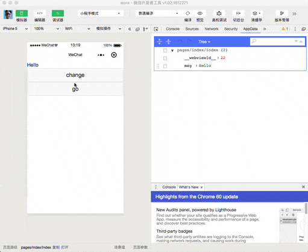

# 小程序全局状态管理器

一个基于flux架构的小程序状态管理器，为小程序带来类似于Vuex的开发体验。



## 安装
Clone 本项目到本地，然后将 `lib/Store.js` 放到你的小程序项目目录之中。

## 使用

首先对 Store 进行实例化，在这里定义初始的 state 对象和一些 mutation。

**注意：所有参与全局状态管理的数据都必须在 state 中预先定义好。**

```
// store/index.js
const Store = require('../lib/Store')

const store = new Store({
  state: {
    msg: 'Hello'
  },
  mutations: {
    change (state, value) {
      state.msg = value
    }
  }
})

module.exports = store
```

接着将这个 Store 实例引入需要使用状态管理的页面之中，并且使用 `initStore` 声明需要在此界面使用的全局数据。

`initStore` 是一个对象，以下面的代码为例，前面的 `msg` 代表了该数据在本页面中的 key，后面跟着的 `'msg'` 则代表数据在 `store.state` 中对应的key，二者并不要求一定相等。

```
// pages/index/index.js
const store = require('../../store/index')

Page(store.createPage({
  data: {
  },
  initStore: {
    msg: 'msg'
  }
}))
```

在经过以上这番声明之后，即可在该页的任何地方，通过 `this.data.msg` 获取到对应的数据，使用方法与普通的 data 没有区别。

当需要修改数据时，只需要通过commit来调用之前在 `mutations` 中定义的方法，即可完成数据的修改。所有引用了此数据的界面，都会自动更新。

```
store.commit('change', 'Hello World')
```

值得注意的是，本状态管理器并不强制你一定得通过flux的方式，对数据进行更新。如果你并不认为这是必要的，也可以直接通过修改 `store.state` 的数据来达成相同的效果。

